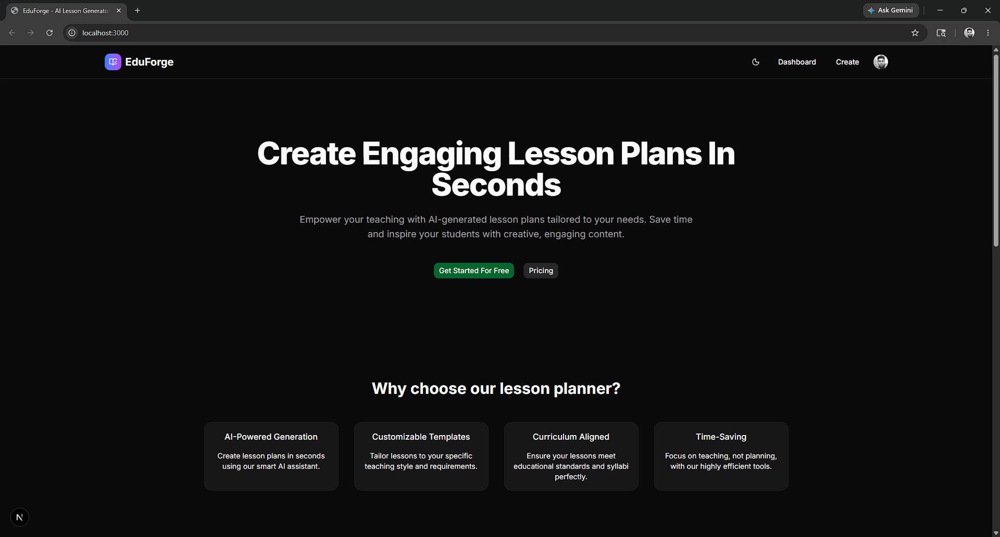
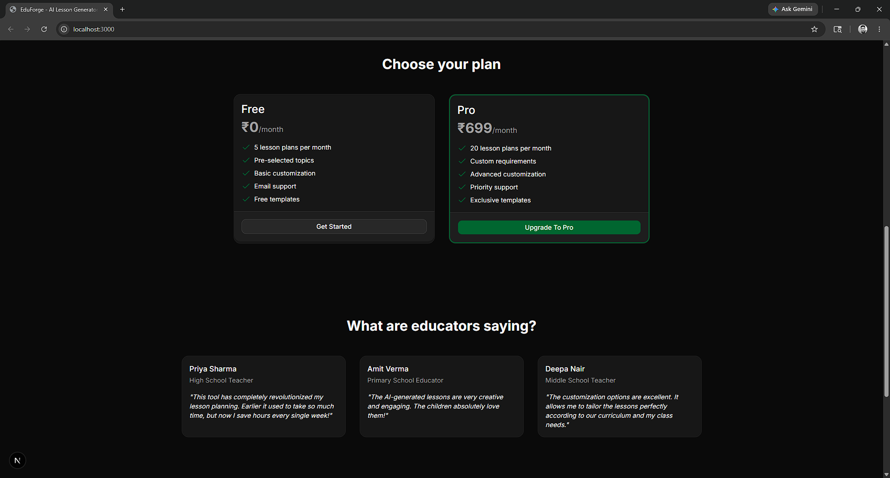
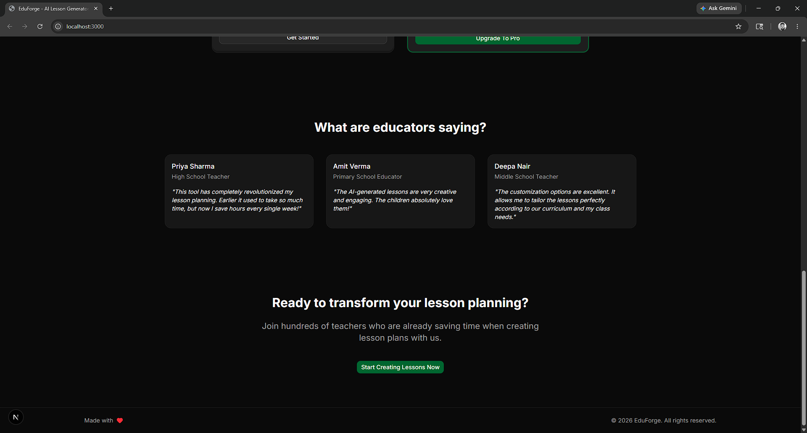
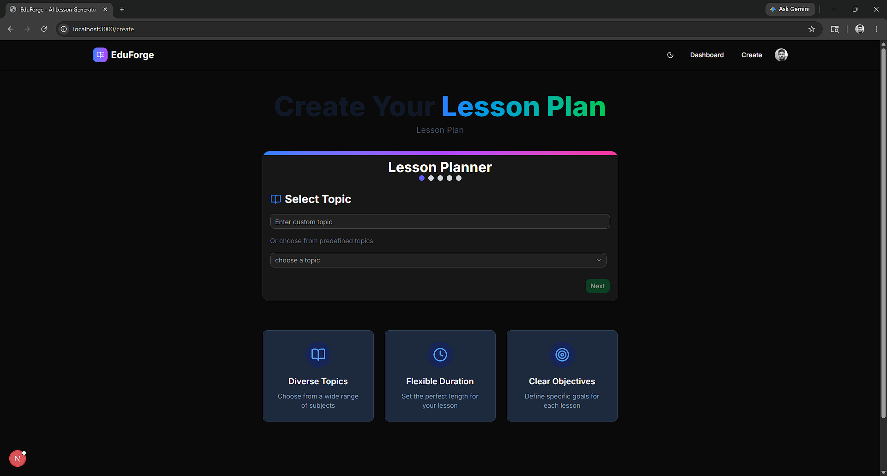
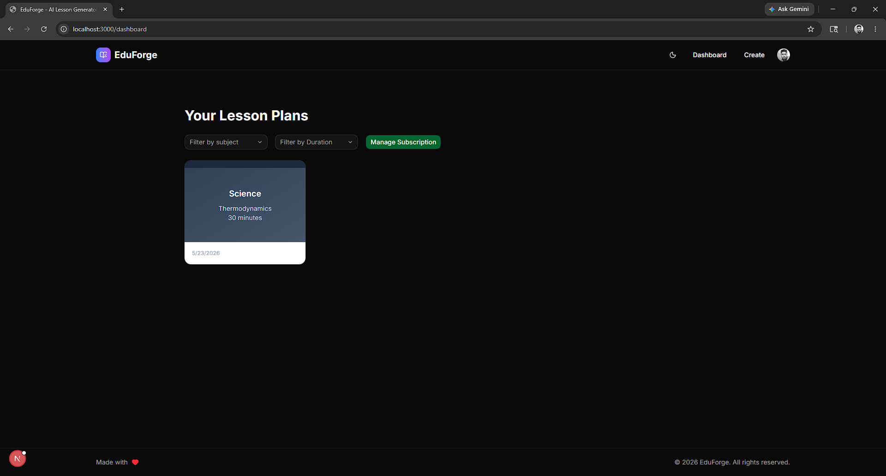
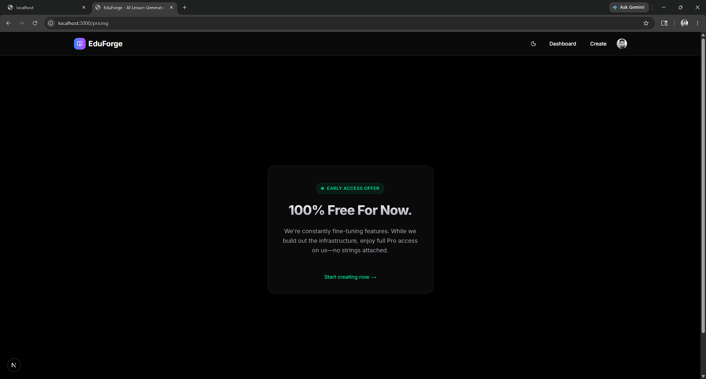
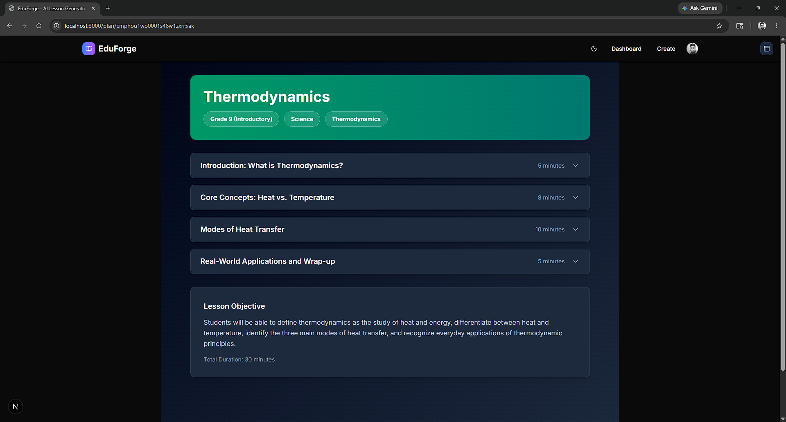
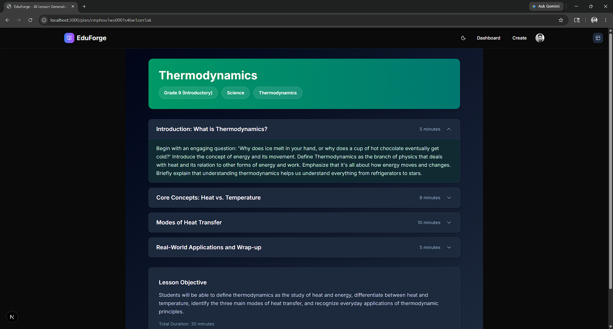

# 📚 EduForge — AI-Powered Lesson Planner

EduForge is an intelligent, modern web application designed to help educators, teachers, and instructors generate comprehensive, structured, and customized lesson plans in seconds. 

By leveraging the power of advanced Generative AI (Google Gemini), EduForge takes the tedious and time-consuming task of drafting lesson plans and turns it into a simple, multi-step process. Teachers can spend less time writing paperwork and more time doing what they do best: teaching!

---

## 🌟 Key Benefits

*   **⏱️ Fast Generation:** Creates full lesson plans in under 30 seconds.
*   **🎯 Tailored Lessons:** Adapts to any subject, grade level, and duration.
*   **📖 Timed Outlines:** Schedules class activities and discussions automatically.
*   **📁 Dashboard Storage:** Saves all plans in one place for easy reuse.

---

## 📖 User Guide

1. **Login:** Sign up or sign in securely via Clerk.
2. **Open Form:** Click **Create Lesson Plan** in the navbar.
3. **Fill Wizard (5 Steps):** Set Topic, Subtopic, Duration, Student Level, and Learning Objective.
4. **Generate:** Click **Generate** to prompt the Gemini AI.
5. **View & Reuse:** Read the timed lesson layout and access it anytime from your **Dashboard**.

---

## 🛠️ Tech Stack

*   **Frontend:** Next.js 16 (React 19), Tailwind CSS 4
*   **Database & ORM:** PostgreSQL & Prisma ORM
*   **Authentication:** Clerk
*   **AI Engine:** Google Gemini API (`@google/generative-ai`)

---

## 📸 Screenshots & UI Preview

<table width="100%">
  <tr>
    <td valign="top" width="50%">
      <p align="center"><b>🏠 Landing Page (Header)</b></p>
      
    </td>
    <td valign="top" width="50%">
      <p align="center"><b>✨ Landing Page (Features)</b></p>
      
    </td>
  </tr>
  <tr>
    <td valign="top" width="50%">
      <p align="center"><b>💬 Landing Page (Reviews)</b></p>
      
    </td>
    <td valign="top" width="50%">
      <p align="center"><b>✍️ Lesson Plan Creator Wizard</b></p>
      
    </td>
  </tr>
  <tr>
    <td valign="top" width="50%">
      <p align="center"><b>📊 Educator Dashboard</b></p>
      
    </td>
    <td valign="top" width="50%">
      <p align="center"><b>💰 Tiered Pricing Plans</b></p>
      
    </td>
  </tr>
  <tr>
    <td valign="top" width="50%">
      <p align="center"><b>📖 Detailed Lesson View (Part 1)</b></p>
      
    </td>
    <td valign="top" width="50%">
      <p align="center"><b>📖 Detailed Lesson View (Part 2)</b></p>
      
    </td>
  </tr>
</table>

---

## 🚀 How to Set Up Locally

### 1. Clone the Project & Install Dependencies
```bash
git clone https://github.com/Subhradeep-Sikder/EduForge.git
cd EduForge
npm install
```

### 2. Configure Environment Variables
Create a `.env` file in the project's root directory and define the following variables:

```env
# Clerk Authentication
NEXT_PUBLIC_CLERK_PUBLISHABLE_KEY=your_clerk_publishable_key
CLERK_SECRET_KEY=your_clerk_secret_key
NEXT_PUBLIC_CLERK_SIGN_IN_URL=/sign-in
NEXT_PUBLIC_CLERK_SIGN_UP_URL=/sign-up
NEXT_PUBLIC_CLERK_SIGN_IN_FALLBACK_REDIRECT_URL=/
NEXT_PUBLIC_CLERK_SIGN_UP_FALLBACK_REDIRECT_URL=/

# PostgreSQL Database Connection
DATABASE_URL=your_postgresql_database_url

# Google Gemini API Key
GEMINI_API_KEY=your_gemini_api_key
```
Get keys: [Gemini API Key](https://aistudio.google.com/app/apikey) | [Prisma Console (Database)](https://console.prisma.io) | [Clerk Dashboard (Auth)](https://clerk.com)

### 3. Setup Database Schema & Run
Sync the database tables and start the Next.js development server:
```bash
npx prisma migrate dev --name init
npm run dev
```
Navigate to `http://localhost:3000` in your web browser.

---

## 📂 Project Structure

```text
EduForge/
├── app/                  # Next.js App Router folders
│   ├── (auth)/           # Secure authentication routes
│   ├── create/           # Multi-step creation form page
│   ├── dashboard/        # Educator's dashboard
│   ├── plan/[id]/        # Individual plan viewer
│   ├── pricing/          # Premium subscription layouts
│   └── layout.tsx        # App wrapper and navbar
├── components/           # Reusable components
│   ├── ui/               # Tailored Shadcn UI elements
│   ├── common/           # Navigation headers and footers
│   ├── LessonPlanForm.tsx# Creation wizard step logic
│   └── Plan.tsx          # Presentation view for lessons
├── lib/                  # Utilities (animations, prisma setup)
├── prisma/               # Schema blueprints for database
└── constants.ts          # Default subjects, durations, and levels
```

---

## 🔮 Future Development Plans

1.  **💳 Stripe Integration:** Turn on payment processing for premium levels. (Prisma schema already includes `stripe_customer_id`).
2.  **📄 Export Options:** One-click exports to PDF, Word, or Markdown.
3.  **🧠 Interactive Extras:** Auto-generate quizzes, homework, and activity worksheets.
4.  **👥 Collaboration:** Shared folders and public links to send plans to colleagues.

---

<p align="center">Build with ❤️</p>

